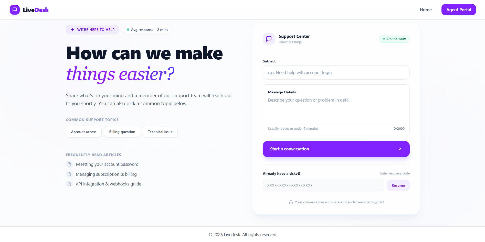
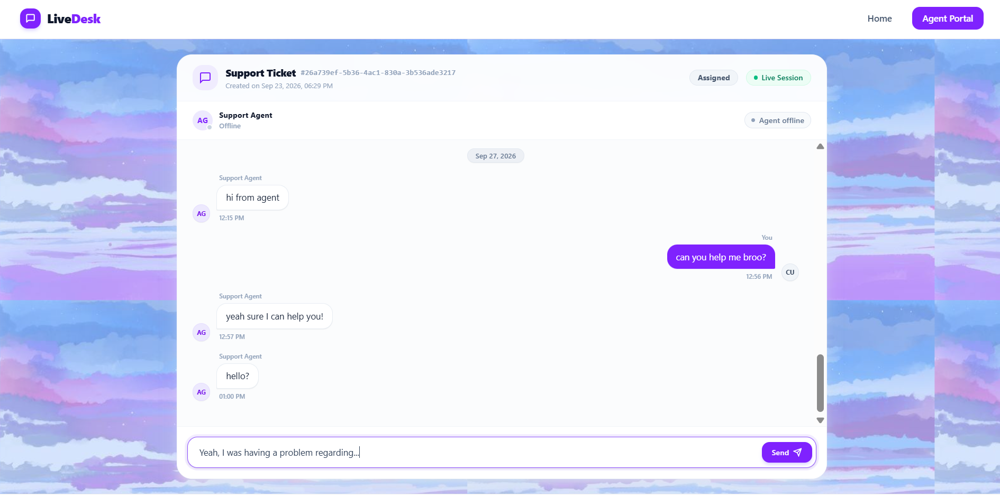
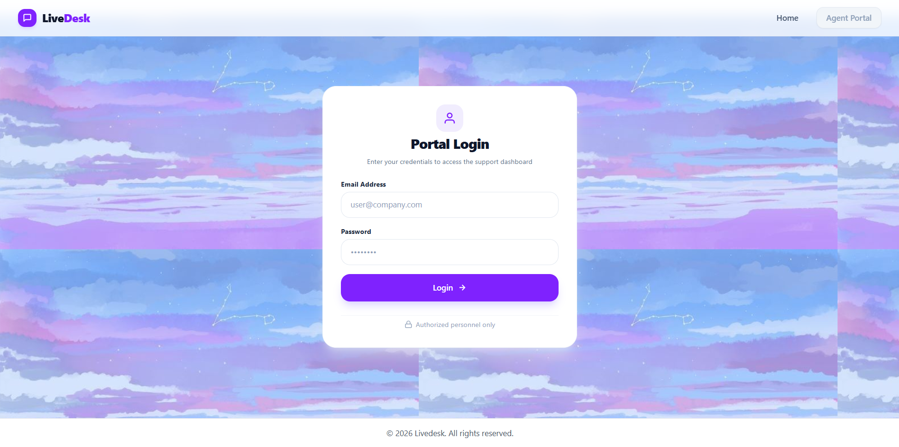
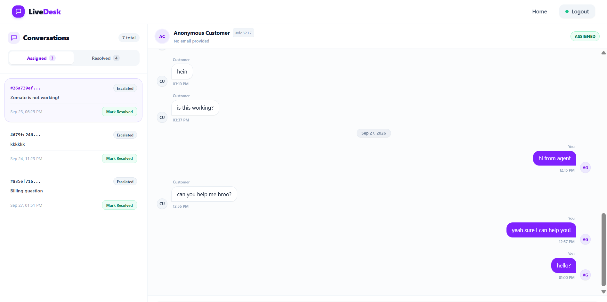
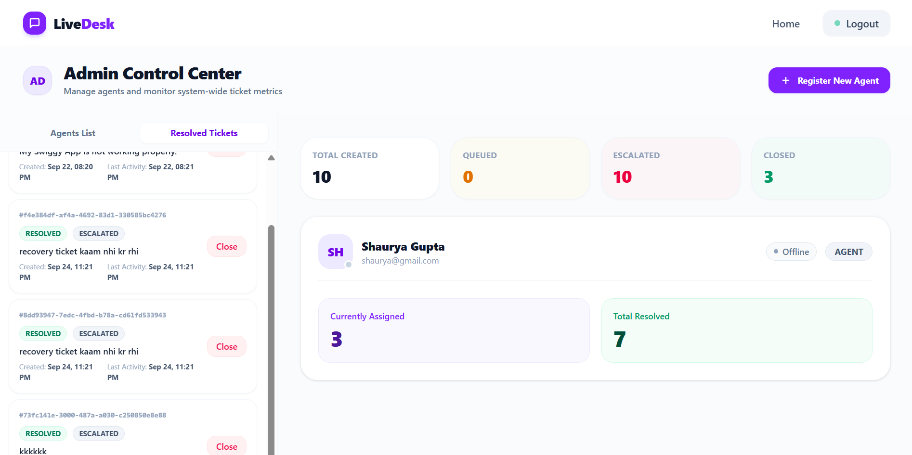
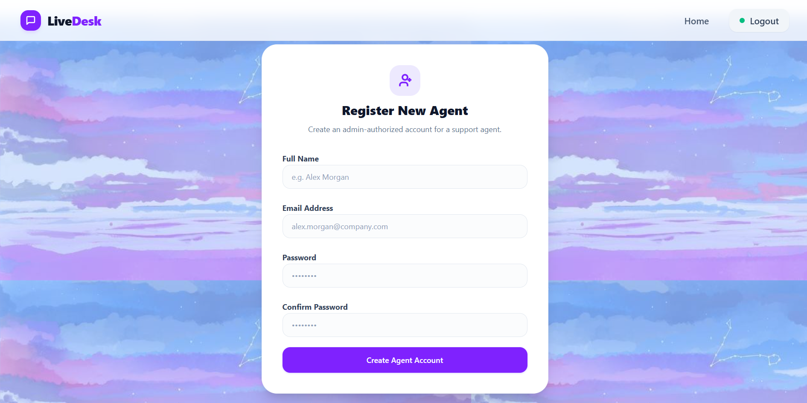
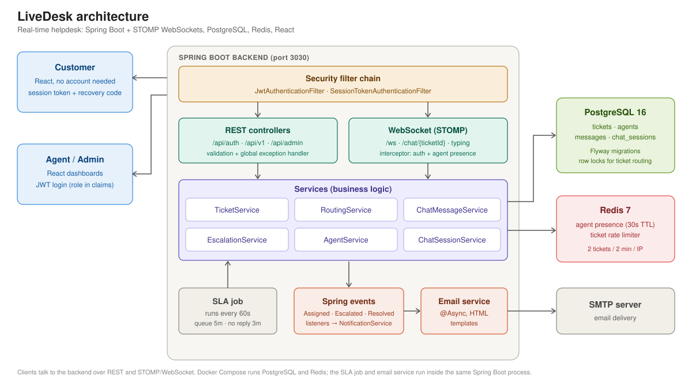

# LiveDesk

[](LICENSE)
[]()
[]()
[]()

A real-time customer support and helpdesk platform. Customers open a ticket and chat live with a support agent, with no sign-up. The backend routes each ticket to an available agent, queues it when everyone is busy, and escalates it automatically when the SLA is missed.

Built with **Spring Boot 4, WebSockets (STOMP), PostgreSQL, Redis** on the backend and **React 19** on the frontend.

## Screenshots

| Landing page                                    | Customer ticket chat                                         |
|-------------------------------------------------|--------------------------------------------------------------|
|  |  |

| Agent / admin login                               | Agent ticket view                                      |
|---------------------------------------------------|--------------------------------------------------------|
|  |  |

| Admin dashboard                                    | Agent registration                                       |
|----------------------------------------------------|----------------------------------------------------------|
|  |  |

## Table of Contents

- [Features](#features)
- [Architecture](#architecture)
- [Tech Stack](#tech-stack)
- [Getting Started](#getting-started)
    - [Prerequisites](#prerequisites)
    - [1. Configure environment](#1-configure-environment)
    - [2. Start PostgreSQL and Redis](#2-start-postgresql-and-redis)
    - [3. Run the backend](#3-run-the-backend)
    - [4. Run the frontend](#4-run-the-frontend)
    - [5. Try it out](#5-try-it-out)
- [API Overview](#api-overview)
- [Project Structure](#project-structure)
- [Running the Tests](#running-the-tests)
- [Roadmap](#roadmap)
- [Contributing](#contributing)
- [License](#license)

## Features

### For customers (no account needed)

- Open a ticket with a subject and first message
- Live chat with the assigned agent, with typing indicators and agent online status
- Queue position shown while waiting for an agent
- A one-time recovery code lets you return to your chat if you lose your session

### For agents

- JWT login, a live list of assigned tickets, and real-time chat
- Resolve tickets, and see resolved ticket history
- Instant notifications when a ticket is assigned or escalated

### For admins

- Create agent accounts
- System-wide stats and per-agent details
- Escalation notifications, and close resolved tickets

### Under the hood

- **Smart routing:** A new ticket goes to an online agent with free capacity (max 3 concurrent chats each). If none is available it is queued, and queued tickets are assigned oldest-first as agents free up. Agents are locked at the database level so two tickets can't be assigned to the same free slot.
- **SLA escalation:** A scheduled job runs every minute. A ticket is escalated if it has been queued for more than 5 minutes, or if a customer message has gone unanswered for more than 3 minutes.
- **Agent presence:** Tracked in Redis with a 30-second TTL that is refreshed while the agent's WebSocket is connected.
- **Rate limiting:** Ticket creation is limited to 2 requests per 2 minutes per IP, using Redis.
- **Email notifications:** Async HTML emails for assignments and escalations, driven by Spring application events.

## Architecture



### Two kinds of authentication

| Who | How | Why |
|---|---|---|
| Agent / Admin | JWT (HMAC-signed, role in claims) | Standard stateless login for staff |
| Customer | Opaque session token tied to one ticket | Customers have no account, and a token can only access its own ticket |

Every ticket and message access is checked by `TicketAuthorizationService`: a customer can only reach their own ticket, and an agent only tickets assigned to them.

### Ticket lifecycle

```text
OPEN -> QUEUED -> ASSIGNED -> RESOLVED -> CLOSED
   \________________^
```

Transitions are enforced inside the `Ticket` domain class, so an invalid change (for example closing an unresolved ticket) throws instead of silently corrupting state.

## Tech Stack

| Layer | Technology |
|---|---|
| Backend | Java 21, Spring Boot 4.1, Spring Security, Spring Data JPA, Spring WebSocket (STOMP) |
| Data | PostgreSQL 16, Flyway migrations, Redis 7 |
| Auth | JWT (jjwt), BCrypt, session tokens |
| Frontend | React 19, Vite, Tailwind CSS 4, React Router, TanStack Query, Zustand, Zod, STOMP.js |
| Infra | Docker Compose (PostgreSQL + Redis) |

## Getting Started

### Prerequisites

- Java 21
- Node.js 20+
- Docker (for PostgreSQL and Redis)

### 1. Configure environment

Create a `.env` file in the **repo root** (the backend loads it on startup):

```env
# Database
DB_USER=livedesk
DB_PASSWORD=change-me

# JWT (use a long random secret, at least 32 characters)
JWT_SECRET=replace-with-a-long-random-string
JWT_EXPIRATION_MS=900000

# Seeded admin account (created on first start)
ADMIN_EMAIL=admin@example.com
ADMIN_PASSWORD=change-me-too

# SMTP (for email notifications)
MAIL_HOST=smtp.example.com
MAIL_PORT=587
MAIL_USERNAME=your-username
MAIL_PASSWORD=your-password
```

### 2. Start PostgreSQL and Redis

```bash
docker compose up -d
```

PostgreSQL is exposed on port `5423` and Redis on `6379`.

### 3. Run the backend

```bash
cd backend
./mvnw spring-boot:run
```

The API starts on **http://localhost:3030**. Flyway creates the schema automatically and the admin account is seeded from your `.env`.

### 4. Run the frontend

```bash
cd frontend
npm install
npm run dev
```

Open the URL Vite prints (usually http://localhost:5173).

### 5. Try it out

1. Log in as the admin and create an agent account.
2. Log in as that agent in one browser window.
3. In another window (or incognito), open a ticket as a customer and start chatting.

## API Overview

| Method | Endpoint | Access | Purpose |
|---|---|---|---|
| POST | `/api/auth/login` | Public | Agent / admin login, returns JWT |
| POST | `/api/v1/tickets` | Public (rate limited) | Create ticket, returns session token and recovery code |
| POST | `/api/v1/tickets/recover` | Public | Get a new session token using the recovery code |
| GET | `/api/v1/tickets/{id}` | Customer or agent | Ticket status |
| GET | `/api/v1/tickets/{id}/messages` | Ticket participants | Paginated chat history |
| GET | `/api/v1/tickets/{id}/agent-presence` | Authenticated | Is the assigned agent online |
| GET | `/api/v1/tickets/assigned` / `resolved` | Agent | Agent's own tickets |
| PATCH | `/api/v1/tickets/{id}/resolve` | Assigned agent | Resolve a ticket |
| POST | `/api/admin/agents` | Admin | Create an agent |
| GET | `/api/v1/admin/agents`, `/stats` | Admin | Agent list and system stats |
| POST | `/api/v1/admin/tickets/{id}/close` | Admin | Close a resolved ticket |

**WebSocket (STOMP)** at `/ws`: send chat messages to `/chat/{ticketId}` and typing events to `/chat/{ticketId}/typing`. Subscribe to `/topic/ticket/{ticketId}/notifications` (customers), `/queue/notifications` (agents) and `/topic/admin/notifications` (admins).

## Project Structure

```text
LiveDesk/
├── backend/src/main/java/com/livedesk/
│   ├── auth/          JWT + session-token filters, security config, ticket access checks
│   ├── agent/         agents, admin APIs, presence (Redis), password hashing
│   ├── ticket/        ticket domain, routing, escalation, rate limiter
│   ├── chatsession/   customer session tokens
│   ├── messenger/     chat messages, STOMP config + channel interceptor
│   ├── events/        application events, listeners, email service
│   ├── scheduler/     SLA escalation job
│   └── common/        global exception handling
├── backend/src/main/resources/db/migration/   Flyway SQL migrations
├── frontend/          React app (customer chat, agent + admin dashboards)
├── docs/              design notes
└── docker-compose.yml
```

## Running the Tests

```bash
cd backend
./mvnw test
```

Unit tests cover the ticket state machine, agent capacity rules, JWT generation and validation, recovery-code generation, and ticket access control. They use plain JUnit 5 with no mocking framework.

## Roadmap

- Tests for routing and escalation using in-memory fakes
- Dockerfile for the backend and a CI workflow
- Message read receipts and file attachments

## Contributing

<!-- TODO: Add contribution guidelines, code of conduct, and pull request workflow -->
Contributions are welcome! Please open an issue or pull request for suggested improvements.

## License

MIT, see [LICENSE](LICENSE).
